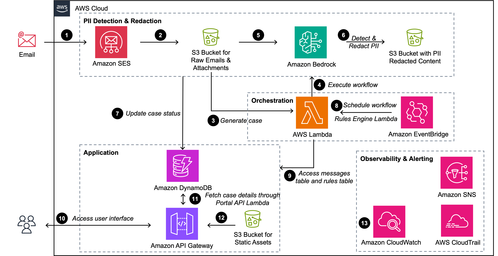

# Multimodal PII Redaction Using Amazon Bedrock

## About
This repository contains a solution for Multimodal PII (Personally Identifiable Information) Redaction using Amazon Bedrock. The solution provides a workflow for detecting and redacting PII from emails and attachments using various AWS services including Amazon Bedrock Data Automation, Amazon Bedrock Guardrails, Lambda, S3, DynamoDB, and more.

## Solution Architecture 
The following diagram outlines the solution architecture. 



The diagram illustrates the backend PII detection and redaction workflow and the frontend application user interface orchestrated by [AWS Lambda](https://aws.amazon.com/lambda/) and [Amazon EventBridge](https://aws.amazon.com/eventbridge/). The process follows these steps:
1.	The workflow starts with the user sending an email to the incoming email server hosted on [Amazon Simple Email Service](https://aws.amazon.com/ses/) (Amazon SES)(optional). 
2.	Amazon SES then stores the emails and attachments in an [Amazon Simple Storage Service](https://aws.amazon.com/s3/) (S3) landing bucket. 
3.	An S3 event notification triggers the initial processing AWS Lambda function that generates a unique case ID and creates a tracking record in [Amazon DynamoDB](https://aws.amazon.com/dynamodb/).
4.	Lambda orchestrates the PII detection and redaction workflow by extracting email body and attachments from the email and saving in raw email bucket followed by invoking [Amazon Bedrock Data Automation](https://aws.amazon.com/bedrock/bda/) and [Amazon Bedrock Guardrails](https://aws.amazon.com/bedrock/guardrails/) for detecting and redacting PII. 
5.	Amazon Bedrock Data Automation processes attachments to extract text from the files.
6.	Amazon Bedrock Guardrails detects and redacts the PII from both email body and text from attachments, and then stores the redacted content in another S3 bucket.
7.	DynamoDB tables are updated with email messages, folders metadata, and email filtering rules. 
8.	An Amazon EventBridge Scheduler is used to run the Rules Engine Lambda on a schedule which will process new emails that have yet to be categorized into folders based on enabled email filtering rules criteria. 
9.	The Rules Engine Lambda also communicates with DynamoDB to access the messages table and the rules table.
10.	Users access the application user interface with Basic Authentication and [Amazon API Gateway](https://aws.amazon.com/api-gateway/) manages user API requests.
11.	A Portal API Lambda fetches the case details based on user requests.
12.	The static assets served by API Gateway are stored in a private S3 bucket.
13.	[Amazon CloudWatch](https://aws.amazon.com/cloudwatch/) and [AWS CloudTrail](https://aws.amazon.com/cloudtrail/) provide visibility into the PII detection and redaction process, while [Amazon Simple Notification Service](https://aws.amazon.com/sns/) delivers real-time alerts for any failures, ensuring immediate attention to issues.

## Infrastructure
### Install Prerequisites
This application requires the installation of the following software tools:
* [Python v3.12 or higher](https://www.python.org/downloads/)
* [Node v18 or higher](https://nodejs.org/en/download/package-manager)
* [NPM v9.8 or higher](https://docs.npmjs.com/downloading-and-installing-node-js-and-npm)
* [AWS CDK v2.166 or higher](https://docs.aws.amazon.com/cdk/v2/guide/getting_started.html)
* Terminal/CLI such as macOS Terminal, PowerShell or Windows Terminal, or the Linux command line. [AWS CloudShell](https://aws.amazon.com/cloudshell/) can also be used when all code is located within an AWS account.

### Infrastructure Prerequisites
All CloudFormation stacks need to be deployed within the same AWS account.

An existing [VPC](https://docs.aws.amazon.com/vpc/latest/userguide/create-vpc.html) that contains 3 private subnets with no internet access is needed.

### CloudFormation Stacks
The solution contains 3 stacks (2 required, 1 optional) that will be deployed in your AWS account:
* **S3Stack** - Provisions the core infrastructure including S3 buckets for raw and redacted email storage with automatic lifecycle policies, a DynamoDB table for email metadata tracking with time-to-live (TTL) and global secondary indexes, and VPC security groups for secure Lambda function access. It also creates IAM roles with comprehensive permissions for S3, DynamoDB, and Bedrock services, forming the secure foundation for the entire PII detection and redaction workflow.

* **ConsumerStack** - Provisions the core processing infrastructure including Amazon Bedrock Data Automation projects for document text extraction and Bedrock Guardrails configured to anonymize comprehensive PII entities, along with Lambda functions for email and attachment processing with SNS topics for success/failure notifications. It also creates SES receipt rules for incoming email handling when a domain is configured, Lambda layers for dependency management, and S3 event notifications to trigger the email processing workflow automatically.

* **PortalStack (optional)** - Provisions the optional web interface including a regional API Gateway with Lambda authorizer for Basic Auth, DynamoDB tables for folders and rules management, and S3 buckets for static web assets. It also creates EventBridge schedulers for automated rules processing, lambda functions for portal API handling and email forwarding functionality when configured.

### Amazon SES (optional)
**Move directly to the Solution Deployment section below if you are not using Amazon SES**
Below Amazon SES Setup is optional. One can test the code without this setup as well. Steps to test the application with or without Amazon SES is covered in **Testing** section.

Set up Amazon SES with prod access and verify the domain/email identities for which the solution is to work. We also need to add the MX records in the DNS provider maintaining the domain. Please refer to the links below:

* [Request SES Production Access](https://docs.aws.amazon.com/ses/latest/dg/request-production-access.html)
* [Setting up Amazon SES email receiving](https://docs.aws.amazon.com/ses/latest/dg/receiving-email-setting-up.html)

Create credentials for SMTP and save it in [AWS Secrets Manager](https://aws.amazon.com/secrets-manager/) secret with name `SmtpCredentials`. **Please note that an IAM user is created for this process**

If using any other name for secret update the `context.json` line `secret_name` with the name of the secret created.

Key for the user name in the secret should be `smtp_username` and key for password should be `smtp_password` when storing the same in AWS Secrets Manager

* [Obtaining Amazon SES SMTP credentials](https://docs.aws.amazon.com/ses/latest/dg/smtp-credentials.html)

### Solution Deployment
Run all of the following commands from within a terminal/CLI environment.

Clone the repository

```sh
git clone https://github.com/aws-samples/sample-bda-redaction.git
```

The `infra/cdk.json` file tells the CDK Toolkit how to execute your app.

```sh
cd sample-bda-redaction/infra/
```

**Optional:** Create and activate a new Python virtual environment (make sure you are using python 3.12 as lambda is in CDK is configured for same. If using some other python version update CDK code to reflect the same in lambda runtime)

```sh
python3 -m venv .venv
. .venv/bin/activate
```

Upgrade pip

```sh
pip install --upgrade pip
```

Install Python packages

```sh
pip install -r requirements.txt
```

Create `context.json` file

```sh
cp context.json.example context.json
```

Update the `context.json` file with the correct configuration options for the environment.

| Property Name | Default | Description | When to Create |
| ------ | ---- | -------- | ---- |
| vpc_id | `""` | VPC ID where resources will be deployed | VPC needs to be created prior to execution |
| raw_bucket | `""` | S3 bucket storing raw messages and attachments | Created during CDK deployment |
| redacted_bucket_name | `""` | S3 bucket storing redacted messages and attachments | Created during CDK deployment |
| inventory_table_name | `""` | DynamoDB table name storing redacted message details | Created during CDK deployment |
| resource_name_prefix | `""` | Prefix used when naming resources during the stack creation | During stack creation |
| retention | `90` | Number of days for retention of the messages in the redacted and raw S3 buckets | During stack creation|

The following properties are only required when the portal is being provisioned.

| Property Name | Default | Description | 
| ------ | ---- | -------- | 
| environment | `development` | The type of environment where resources will be provisioned. Values are `development` or `production` |

Use cases that require the usage of Amazon SES to manage redacted email messages will need to set the following configuration variables. Otherwise, these are optional.

| Property Name | Description | Comment |
| ------ | -------- | ---------|
| domain | The verified domain or email name that is used for Amazon SES | This can be left blank if not setting up Amazon SES
| auto_reply_from_email | Email address of the "from" field of the email message. Also used as the email address where emails are forwarded from the Portal application | This can be left blank if not setting up the Portal
| secret_name | AWS Secrets Manager secret containing SMTP credentials for forward email functionality from the portal | |


#### Deploy Infrastructure
Run the following commands from the root of the `infra` directory:

Bootstrap the AWS account to use AWS CDK
```sh
cdk bootstrap
```

At this point you can now synthesize the CloudFormation template for this code. Additional environment variables before the cdk synth suppresses the warnings. The deployment process should take approximately 10 min for a first-time deployment to complete.

```sh
JSII_DEPRECATED=quiet JSII_SILENCE_WARNING_UNTESTED_NODE_VERSION=quiet cdk synth --no-notices
```

Replace ```<<resource_name_prefix>>``` with its chosen value and then run:
```sh
JSII_DEPRECATED=quiet JSII_SILENCE_WARNING_UNTESTED_NODE_VERSION=quiet cdk deploy <<resource_name_prefix>>-S3Stack <<resource_name_prefix>>-ConsumerStack --no-notices
```

### Testing
#### Testing the application with Amazon SES
Before starting the test make sure Amazon SES Email Receiving rule set created by the `<<resource_name_prefix>>-ConsumerStack` stack is active. We can check by executing below command and make sure name in the output is `<<resource_name_prefix>>-rule-set`

```sh
aws ses describe-active-receipt-rule-set
```
If the name does not match or the output is blank, execute below to activate the same:

```sh
# Replace <<resource_name_prefix>> with resource_name_prefix used in context.json

aws ses set-active-receipt-rule-set --rule-set-name <<resource_name_prefix>>-rule-set
```

Once we have the correct rule set active, to test the application using Amazon SES, you just need to send email to the verified email or domain in Amazon SES, which will automatically trigger the redaction pipeline. 

You can track the progress in the DynamoDB table `<<inventory_table_name>>`. Inventory table name can be found on the resources tab in the AWS CloudFormation Console for the `<<resource_name_prefix>>-S3Stack` stack and Logical ID `EmailInventoryTable`. 

A unique `<<case_id>>` is generated and used in the DynamoDB inventory table for each email being processed. Once redaction is completed you can find the redacted email body in `<<redacted_bucket_name>>/redacted/<<today_date>>/<<case_id>>/email_body/` and redacted attachments in `<<redacted_bucket_name>>/redacted/<<today_date>>/<<case_id>>/attachments/`
#### Testing the application without Amazon SES
As described earlier the solution is used to redact any PII data in email body and attachments so to test the application we need to provide an email file which needs to be redacted. 

We can do that without Amazon SES as well by directly uploading an email file to the raw S3 bucket. Raw bucket name can be found on the output tab in the AWS CloudFormation Console for <<resource_name_prefix>>-S3Stack stack and Export Name `RawBucket`. 
This will trigger the workflow of redacting the email body and attachment by S3 event notification triggering the Lambda. 

For convenience a sample email is available in **"infra/pii_redaction/sample_email"** directory of the repository. Below are the steps to test application without Amazon SES using the same email file.

```sh
# Replace <<raw_bucket>> with raw bucket name created during deployment:

aws s3 cp pii_redaction/sample_email/ccvod0ot9mu6s67t0ce81f8m2fp5d2722a7hq8o1 s3://<<raw_bucket>>/domain_emails/
```

The above will trigger the redaction of email process. You can track the progress in the DynamoDB table `<<inventory_table_name>>`. A unique `<<case_id>>` is generated and used in DynamoDB inventory table for each email being processed. 

Inventory table name can be found on the resources tab in the AWS CloudFormation Console for <<resource_name_prefix>>-S3Stack stack and Logical ID `EmailInventoryTable`. 

Once redaction is completed you can find the redacted email body in `<<redacted_bucket_name>>/redacted/<<today_date>>/<<case_id>>/email_body/` and redacted attachments in `<<redacted_bucket_name>>/redacted/<<today_date>>/<<case_id>>/attachments/`

## Portal

**IMPORTANT:** The installation of the portal is completely optional. You can skip this section and check the AWS console of the AWS account where the solution is deployed to view the resources created.

The portal serves as a web interface to manage the PII-redacted emails processed by the backend AWS infrastructure, allowing users to organize, view, and forward sanitized email content.

### Install Prerequisites

This application requires the installation of the following software tools:
* [TypeScript](https://www.typescriptlang.org/)
* [Node v18 or higher](https://nodejs.org/en/download/package-manager)
* [NPM v9.8 or higher](https://docs.npmjs.com/downloading-and-installing-node-js-and-npm)

### Infrastructure Deployment

Synthesize the CloudFormation template for this code by navigating to the directory root of the solution. Then run the following command:

```sh
cd sample-bda-redaction/infra/
```

**Optional:** Create and activate a new Python virtual environment (if the virtual environment has not been created previously):

```sh
python3 -m venv .venv
. .venv/bin/activate
```

```sh
pip install -r requirements.txt
```

At this point you can synthesize the CloudFormation template for this code. 

```sh
JSII_DEPRECATED=quiet JSII_SILENCE_WARNING_UNTESTED_NODE_VERSION=quiet cdk synth --no-notices
```

Deploy the React-based portal. Replace ```<<resource_name_prefix>>``` with its chosen value:

```sh
JSII_DEPRECATED=quiet JSII_SILENCE_WARNING_UNTESTED_NODE_VERSION=quiet cdk deploy <<resource_name_prefix>>-PortalStack --no-notices
```

The first-time deployment should take approximately 10 minutes to complete.

### Authentication

The portal is protected by Basic Authentication. When using Basic Access Authentication the credentials are stored in AWS Secrets Manager using the secret provisioned in the `PortalStack` CloudFormation stack that has been created via AWS CDK. The CloudFormation stack resource is named `PiiRedactionPortalAuthSecret`.

### Environment Variables

Create a new environment file by navigating to the root of the `app` directory and update the following variables in the `.env` file (by copying the `.env.example` file to `.env`) using the following command to create the `.env` file using a terminal/CLI environment:

```sh
cp .env.example .env
```

You can also create the file using your preferred text editor as well.

| Environment Variable Name | Default | Description | Required |
| ------ | ---- | -------- | --------- |
| VITE_APIGW | `""` | Hostname from the API Gateway invoke URL without the path (remove `/portal` from the value) | Yes
| VITE_BASE | `/portal` | It specifies the path used to request the static files needed to  render the portal | Yes
| VITE_API_PATH | `/api` | It specifies the path needed to send requests to the API Gateway | Yes
| VITE_EMAIL_ENABLED | `false` | It enables/disables the forward email function. Values are `true` to enable the feature or `false` to disable it. It should be set to `false` if you have not set up Amazon SES | Yes

### Portal Deployment

Run the following commands from within a terminal/CLI environment:

Before running any of the following commands, navigate to the root of the `app` directory to build this application for production by running the following commands:

Install NPM packages

```sh
npm install
```

Build the files

```sh
npm run build
```

After the build succeeds, transfer all of the files within the _dist/_ directory into the Amazon S3 bucket that is designated for these assets (specified in the PortalStack provisioned via CDK).

Example:

```sh
aws s3 sync dist/ s3://<<name-of-s3-bucket>> --delete
```
`<<name-of-s3-bucket>>` is the S3 bucket that was created in the `<<resource-name-prefix>>-PortalStack` CloudFormation stack with the Logical ID of PrivateWebHostingAssets. This value can be obtained from the Resources tab of the CloudFormation stack in the AWS Console.

This value is also output during the `cdk deploy` process when the PortalStack has been successfully completed.

### Portal Access

Use the API Gateway invoke URL from the API Gateway that has been created during the `cdk deploy` process to access the portal from a web browser. You can find this URL by following these steps:

1. Navigate to the AWS Console
2. Navigate to API Gateway and find the API Gateway that has been created during the `cdk deploy` process. The name of the API Gateway can be found in the Resources section of the `<<resource-name-prefix>>-PortalStack` CloudFormation stack.
3. Click on the **Stages** link in the left-hand menu.
4. Ensure that the ** portal** stage is selected
5. Find the **Invoke URL** and copy that value
6. Enter that value in the address bar of your web browser

You should now see the portal's user interface visible within the web browser. If any emails have been processed, they will be listed on the home page of the portal.

#### Portal Use Cases

##### Email Management
- **List Messages**: View processed emails with redacted content
- **Forward Messages**: Send redacted emails to other recipients (when SES is configured)
- **Export Messages**: Export email data for external use
- **Message Details**: View individual email content and attachments

##### Folder Management
- **Create Folders**: Organize emails into custom folders
- **List Folders**: View and manage existing folder structure
- **Delete Folders**: Remove folders when no longer needed

##### Rules Engine
- **Create Rules**: Define automated email categorization rules
- **List Rules**: View existing email filtering rules
- **Toggle Rules**: Enable/disable rules without deletion
- **Delete Rules**: Remove rules permanently

### Troubleshooting
#### Deployment Issues
Running the CDK deployment through a Terminal/CLI environment will notify the user if there is a deployment failure through `stderr` in the Terminal/CLI environment. 
* [Troubleshoot CloudFormation](https://docs.aws.amazon.com/AWSCloudFormation/latest/UserGuide/troubleshooting.html) when encountering issues when you create, update, or delete CloudFormation stacks.

Once deployment issues have been resolved, redeploy the stack using the following commands:

```sh
JSII_DEPRECATED=quiet JSII_SILENCE_WARNING_UNTESTED_NODE_VERSION=quiet cdk synth --no-notices
```

```sh
# Replace <<resource_name_prefix>> with its chosen value:

JSII_DEPRECATED=quiet JSII_SILENCE_WARNING_UNTESTED_NODE_VERSION=quiet cdk deploy <<resource_name_prefix>>-S3Stack <<resource_name_prefix>>-ConsumerStack --no-notices
```

#### Rollback Procedures
Deployment failures will always rollback the current deployment and return the CloudFormation stack(s) to their previous revision without an impact to current operations, configuration and existing resources. The exact error will be displayed in the CLI output and also in the CloudFormation stack events tab.

In the event of a rollback failure, [find solutions](https://docs.aws.amazon.com/AWSCloudFormation/latest/UserGuide/using-cfn-updating-stacks-continueupdaterollback.html) to handle the failures.

## Clean up

To avoid incurring future charges, follow these steps to remove the resources created by this solution:
1.	Delete the contents of the [S3](https://docs.aws.amazon.com/AmazonS3/latest/userguide/delete-bucket.html) buckets created by the solution:
- Raw email bucket
- Redacted email bucket
- Portal static assets bucket (if portal was deployed)
2.  Delete or disable the Amazon SES rule step created by the solution using below cli command:
  ```sh
  #to disable the rule set use below command
  aws ses set-active-receipt-rule-set
  ```
  ```sh
  #to delete the rule set use below command
  # Replace <<resource_name_prefix>> with resource_name_prefix used in context.json
  aws ses delete-receipt-rule-set --rule-set-name <resource_name_prefix>>-rule-set
  ```
3.	Remove the CloudFormation stacks in the following order:
(if deployed)
```sh
cdk destroy <<resource_name_prefix>>-PortalStack 
```
```sh
cdk destroy <<resource_name_prefix>>-ConsumerStack
```
```sh
cdk destroy <<resource_name_prefix>>-S3Stack
```
4.  CDK Destroy does not remove the access log Amazon S3 bucket created as part of the deployment. You can get access log bucket name in the output tab of stack `<<resource_name_prefix>>-S3Stack` with export name `AccessLogsBucket`. Execute below steps to delete the access log bucket:
- Delete the contents of the access log bucket, follow link [S3](https://docs.aws.amazon.com/AmazonS3/latest/userguide/delete-bucket.html)
- Delete the access log Amazon S3 bucket using below aws cli command
  ```sh
  #access log Amazon S3 bucket is version and deleting the content does not delete the versioned objects so need to remove versioned objects first using below aws cli command
  aws s3api delete-objects --bucket ${buckettoempty} --delete "$(aws s3api list-object-versions --bucket ${buckettoempty} --query='{Objects: Versions[].{Key:Key,VersionId:VersionId}}')"
  #once versioned objects are remove we need to remove the delete markers of the versioned objects using below aws cli command
  aws s3api delete-objects --bucket ${buckettoempty} --delete "$(aws s3api list-object-versions --bucket ${buckettoempty} --query='{Objects: DeleteMarkers[].{Key:Key,VersionId:VersionId}}')"
  #delete the access log bucket itself using below aws cli command
  aws s3api  delete-bucket --bucket ${buckettoempty}
  ```
5.	If you have configured Amazon SES:
- [Remove the verified domain/email identities](https://docs.aws.amazon.com/ses/latest/dg/remove-verified-domain.html)
- Delete the MX records from your DNS provider
- Delete the SMTP credentials from [AWS Secrets Manager](https://docs.aws.amazon.com/secretsmanager/latest/userguide/manage_delete-secret.html)
6.	If you have configured the Portal with a custom domain:
- Remove the [API Gateway](https://docs.aws.amazon.com/apigateway/latest/developerguide/getting-started.html) custom domain name
- [Delete any associated ACM certificates](https://docs.aws.amazon.com/acm/latest/userguide/gs-acm-delete.html)
- Remove any DNS CNAME records
7.	[Delete any CloudWatch Log groups](https://docs.aws.amazon.com/solutions/latest/video-on-demand-on-aws-foundation/deleting-the-cloudwatch-logs.html) created by the Lambda functions

Note: The VPC and its associated resources as prerequisites for this solution may not be deleted if they may be used by other applications.
